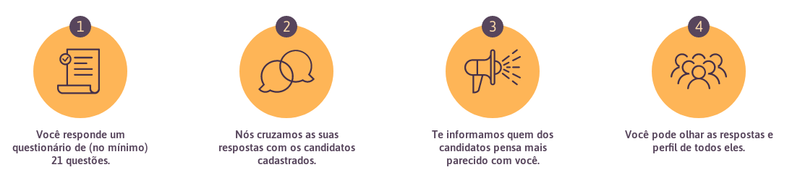

# VotaSP

## O que é o VotaSP?

O projeto é a continuação de uma idéia que deu muito certo em Campinas, 2 anos atrás, o [Vota Campinas](http://votacampinas.org.br/).

A idéia é simplificar o processo de escolha de candidatos para os eleitores. Fazemos isso rankeando primeiramente os candidatos que tem as idéias mais parecidas com as respostas que o eleitor fez de algumas questões.

Todo o projeto é open source e tudo o que o projeto faz é aberto para vocês analisarem. Tentaremos também mostrar as regras envolvidas em todo o processo de maneira mais simples.

## Como vai funcionar?

Todos os usuários, após se cadastrarem (queremos fazer isso de maneira mais simples e anônima possível) responderão uma série de questões com o intuíto de entendermos suas posições políticas. São questões selecionadas para termos a maior quantidade de diferenças, nada de questões óbivias do tipo: "Você é contra a corrupção?" assim, teremos uma noção real das intenções de um candidato.

Tanto os candidatos quanto os eleitores devem responder as mesmas questões, que tem as seguintes opções:
 - Concordo plenamente
 - Concordo
 - Discordo
 - Discordo Plenamente

### Como candidatos vão responder as questões?

Os candidatos deverão se cadastrar e mostrar todas as suas informações. O principal é se cadastrarem com o email informado no TSE, para evitarmos fraudes nas respostas.

Além disso, os candidatos são obrigados a responder TODAS as questões. Se alguma não for respondida, o candidato não aparecerá para nenhum eleitor.

### Como usuários vão responder as questões?

Os usuários podem se cadastrar com e-mail ou redes sociais como em qualquer site/aplicativo (Estamos pensando em soluções para tornar isso o mais anonimo possível).

Os usuários NÃO PRECISAM responder todas as questões. Em todas as questões haverá uma opção para pular. Mas lembre-se que quanto mais você preencher, melhor funcionará esse match.

## Como vamos fazer o match?

- O Candidato vai poder responder com `Concordo Plenamente`, `Concordo`, `Discordo`, `Discordo Plenamente`
- O Eleitor vai poder responder com todas as opções acima e adicionalmente com `Indireferente`, o que irá desconsiderar a questão no cálculo do match.
- Para calcular o match:
  - Uma resposta igual conta 2 pontos
  - Uma reposta distinta, porém concordante (discordo + discordo plenamente, concordo + concordo plenamente), contabiliza 1 ponto
  - Respostas discordantes (concordo + discordo) não contabilizam pontos

Além disso, estamos desenvolvendo uma [Prova de Conceito](https://github.com/Minhacps/votasp-poc-matcher) de como vai funcionar o match internamente. Ajuda lá!

## Como posso ajudar?

Nossa idéia é que qualquer pessoa possa ajudar com o projeto. Temos alguns exemplos como:

### Discord
Você pode ajudar simplesmente conversando e dando feedbacks no nosso [Discord](https://discord.gg/TGfXVHy)

### Desenvolvedores
Estamos em um processo embrionário do projeto. Já temos algumas estruturas de como o sistema deveria se comportar (olhe os repositórios de [front-end](https://github.com/Minhacps/votasp-app) e [back-end](https://github.com/Minhacps/votasp-backend) para entender melhor).

Você pode ajudar contribuindo com issues/pull-requests ou simplesmente aparecendo no nosso Discord pra conversar.

### Ajude a escrever as questões
Você pode nos ajudar ajudando a escrever questões também.
Elas estão no arquivo [QUESTOES.md](QUESTOES.md)

### Ajude a pressionar
Você também pode ajudar o projeto pressionando os candidatos que você conhece a preencher nossas questões. (Isso é muito importante para nós!)

### Ajude com custos do servidor
Você também pode nos ajudar com custos que nossos servidores tem. Estamos planejando uma arquitetura de microserviços e atualmente estamos rodando no Google Cloud.

Se você tem uma ferramenta que usamos, também pode ajudar facilitando os custos, como fizemos com o auth0, por exemplo.

## Contribuição

Agradecemos por considerar contribuir com o VotaSP! Você encontra como fazê-lo em nosso [Guia de Contribuição](CONTRIBUTING.md).

## Código de Conduta

Para garantir que a comunidade do VotaSP seja acolhedora para todos, leia e siga o nosso [Código de Conduta](CODE_OF_CONDUCT.md).

## Licença

O VotaSP é um software de código aberto licenciado sob a [Licença MIT](LICENSE.md).
